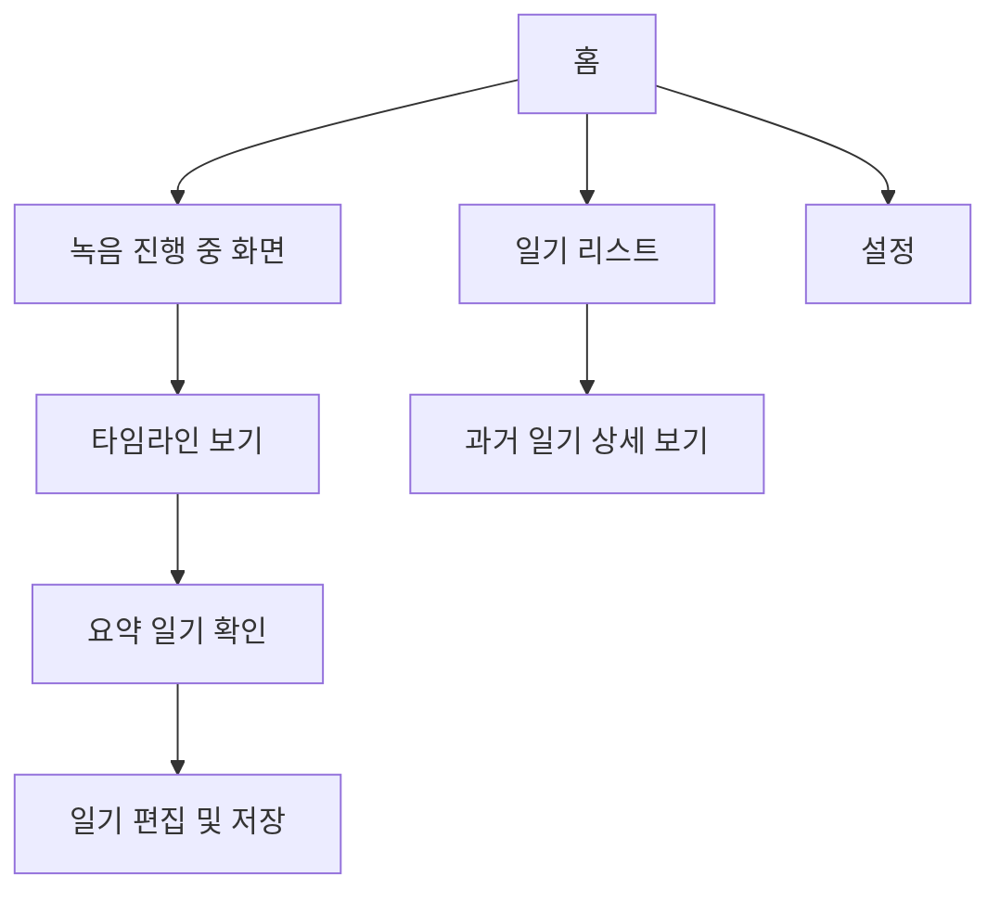

# 하루 자동 일기 앱 – Wireframe 설계 (v0.1)
---

## 🔁 전체 사용자 흐름 요약 (User Flow)

---

## 🏠 1. 홈(Home)
- **요소**
  - 오늘 날짜, 요일
  - 하루 녹음 상태 표시 (진행 중/일시 정지)
  - 요약 상태 (요약 완료 / 분석 중)
  - 주요 요약 문장 (한 줄 미리보기)
  - "일기 쓰기" 버튼
- **버튼**
  - 📂 타임라인 보기
  - 📝 일기 작성
  - ⚙️ 설정

---

## 🎙️ 2. 녹음 진행 화면 (Recording)
- **요소**
  - 현재 시간 / 누적 녹음 시간
  - 음성 시각화 (waveform)
  - 최근 녹음 구간 표시
- **버튼**
  - ⏸️ 일시 정지 / ▶️ 재시작
  - 🔇 소리 없는 구간 감지 표시

---

## ⏱️ 3. 타임라인 보기 (Timeline View)
- **요소**
  - 시간대별 구간 카드
    - [09:00 ~ 09:10] "회의 시작 전"
    - [12:30 ~ 12:45] "점심 시간"
  - 각 구간의 요약 미리보기
- **기능**
  - 클릭 시 오디오 재생
  - 태그/메모 추가 (선택)

---

## ✨ 4. 요약 일기 확인 (Diary Summary)
- **요소**
  - 오늘의 전체 요약 (GPT 기반 요약)
  - 키워드 목록: 회의, 점심, 감정 등
  - 감정 분석 결과 (아이콘 또는 그래프)
- **버튼**
  - ✏️ 편집으로 이동

---

## 📝 5. 일기 편집/작성 (Edit Diary)
- **요소**
  - 자동 생성된 초안 텍스트
  - 사용자 수정 가능 텍스트 입력창
- **버튼**
  - 💾 저장
  - ↩️ 되돌리기
  - 📤 공유 (선택)

---

## 📅 6. 일기 리스트/과거 기록
- **요소**
  - 날짜별 일기 리스트
  - 감정 요약 아이콘
  - 요약 미리보기
- **기능**
  - 클릭 시 해당 일기 상세 보기

---

## ⚙️ 7. 설정(Settings)
- **옵션**
  - 자동 녹음 on/off
  - 녹음 주기 설정 (10분, 15분 등)
  - STT 모델 선택 (Whisper/Google)
  - 클라우드 저장 허용 여부
  - 감정 분석 on/off
  - 앱 잠금 (PIN)

---

## 📌 Wireframe 요약 표

| 화면 | 주요 구성 요소 | 기능 요약 |
|------|----------------|------------|
| 홈 | 날짜, 상태, 버튼 3개 | 현재 상태 요약, 이동 허브 |
| 녹음 | 녹음 시각화, 시간표시 | 실시간 녹음 정보 |
| 타임라인 | 시간대별 구간, 재생 | 하루 구간별 탐색 |
| 요약 | 요약문, 감정 결과 | AI 일기 초안 확인 |
| 편집 | 텍스트 편집창 | 일기 작성 완료 |
| 설정 | 옵션 목록 | 기능 활성화/제어 |
